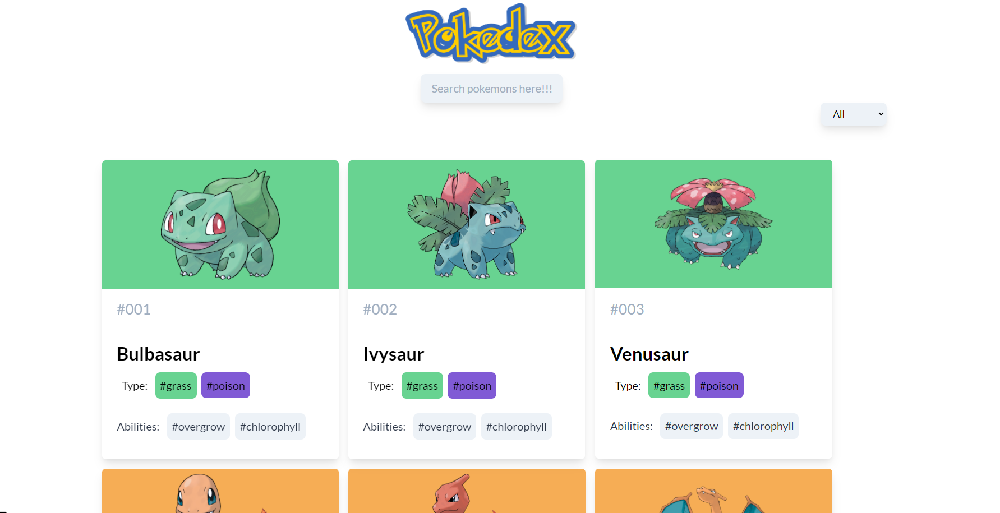

# Pokedex Webapp

Pokedex is a React web application where you can navigate the details of the different pokemon by clicking on the list of pokemon. It has the filter functionality with which you can filter your pokemon with different categories.

## Live Demo

[View Live Demo](https://pokedexi.netlify.app/)

## Screenshots

## Video Presentation

[Visit video presentation](https://www.loom.com/share/ff008366d9f8431d99a6d7e24fb9ef30)

## Features & Usage

- A list of first 150 pokemon that appeared in the show.
- You can see the list of the pokemon by filtering them and searching with text
- When a pokemon is clicked you can see the details of the pokemon along with the evolution

- You can navigate back to the home page by clicking on the logo or on the buttons
- Design is partially responsive although not completely optimized for smartphones.

## Potential Features

- Filter by Types

- Search by pokemon name.

## Setup

1. Clone this repository and access the project's directory.
2. Run "yarn install".

3. Run "yarn start" to work on the development server.

## Built With

- JavaScript/ES6

- React
- React Hooks
- React Router
- Redux
- Tailwind CSS
- React Redux
- Pokeapi
- Netlify

## Author

👤 **Shubham Singh**

- Github: [@shubhsk88](https://github.com/shubhsk88)
- Twitter: [@shubhski](twitter.com/shubski)
- Linkedin: [linkedin](https://www.linkedin.com/in/shubhski/)

## 🤝 Contributing

Contributions, issues and feature requests are welcome!

Feel free to check the [issues page](https://github.com/shubhsk88/pokedex-app/issues).

## Show your support

Give a ⭐️ if you like this project!
